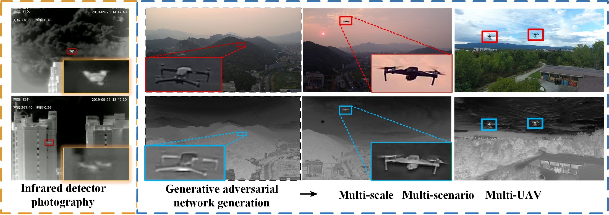

# MSPhys: Physics-Informed Multi-Scale Visible-to-Infrared UAV Image Synthesis

  

  <em>
    A physics-informed multi-scale framework for visible-to-infrared UAV image synthesis
    in air-to-air anti-UAV scenarios.
  </em>

---

## Overview

Infrared UAV perception plays an important role in air-to-air anti-UAV applications because of its passive sensing capability and robustness under low-visibility conditions. However, collecting large-scale, high-quality infrared UAV data is expensive and difficult, especially in real air-to-air environments.

To address this problem, we propose **MSPhys**, a physics-informed multi-scale framework for visible-to-infrared UAV image synthesis. The framework is designed to improve:

- thermal-physical plausibility,
- structural fidelity,
- robustness to scale variation,
- generation quality in complex backgrounds.

MSPhys integrates physics-aware feature modulation, multi-scale representation learning, and deformable adversarial discrimination to generate infrared UAV images that are more suitable for downstream anti-UAV perception tasks.

---

## Highlights

- Physics-informed visible-to-infrared UAV image synthesis
- Multi-scale adaptive modeling for complex air-to-air scenes
- Improved target-background separability and structural preservation
- Practical support for infrared UAV data generation and downstream detection

---

## Project Status

This repository is currently in the **project-introduction stage**.

At this stage, it mainly provides:

- project overview,
- selected figures from the manuscript,
- high-level description of the method,
- planned release information.

**The full source code, pretrained models, and additional reproducibility materials will be released after the paper is accepted/published.**

---

## Paper Information

**Title**  
*Soft Computing-Driven Infrared UAV Image Synthesis from Visible Light: Leveraging Multi-Scale Adaptation and Physical Consistency for Real-World Anti-UAV Applications*

**Status**  
Under review

---

## Included Figures

The folder `assets/original_figures/` contains several figure files extracted from the current revised manuscript for later selection and use on the GitHub project page.

Recommended candidate files:

- `assets/teaser.jpeg`
- `assets/framework_candidate.jpeg`
- `assets/visual_comparison_candidate.jpeg`
- `assets/tev_visualization_candidate.jpeg`

You can later rename them to:

- `assets/framework.png`
- `assets/visual_comparison.png`
- `assets/tev_visualization.png`

once you decide which final images to show on the project homepage.

---

## Planned Release

After acceptance/publication, this repository will be updated with:

- full training and inference code,
- pretrained model checkpoints,
- environment configuration files,
- reproduction instructions,
- additional implementation details and supplementary materials.

---

## Notes

This repository will be updated in stages.  
The current version is intended to provide a concise and readable introduction to the project.  
More materials will be released after the review/publication process.

---

## Citation

Citation information will be added after the paper is accepted/published.
